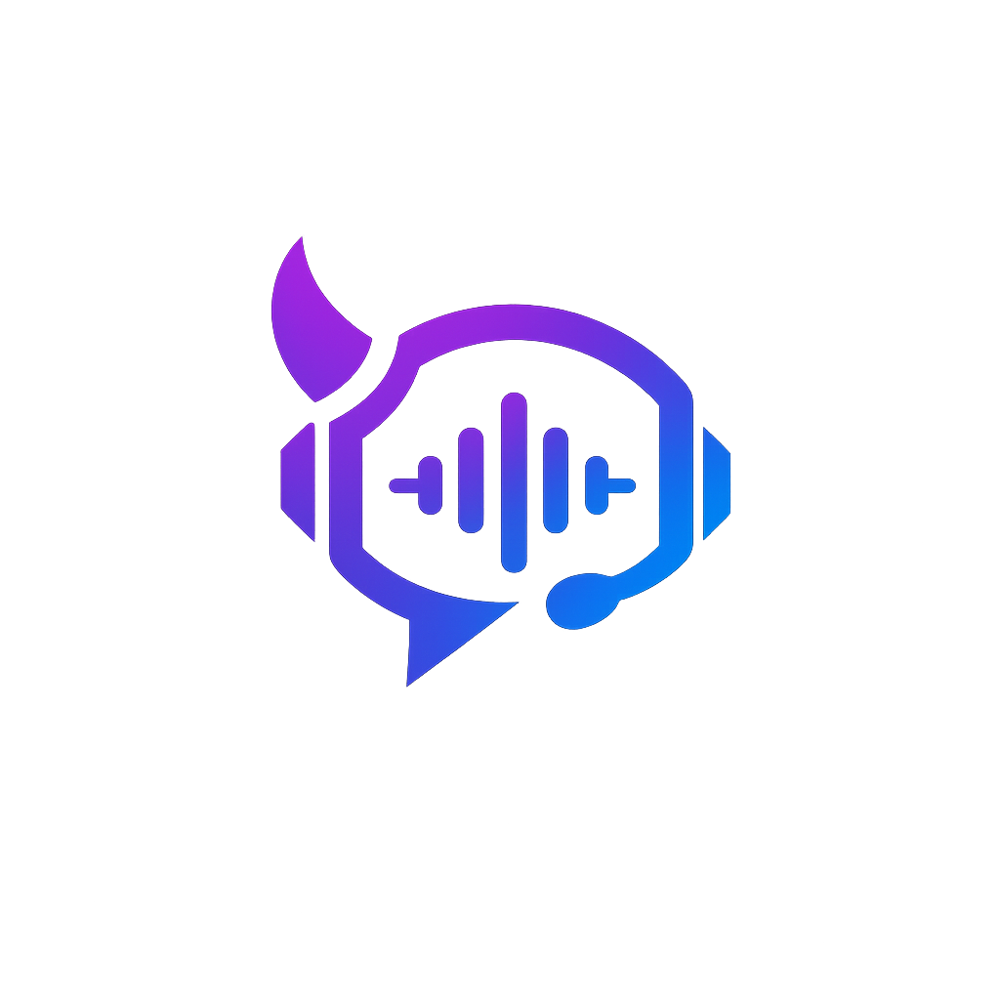

<p align="center">
  
</p>

<h1 align="center">Halla</h1>

<p align="center">
  Cliente de comunicação por voz para desktop (Windows, Linux), escrito em
  <b>C++17</b> e <b>Qt 6 Widgets</b>.
</p>

<p align="center">
  
</p>

---

## Índice

- [Visão geral](#visão-geral)
- [Capturas de tela](#capturas-de-tela)
- [Principais recursos](#principais-recursos)
- [Arquitetura do projeto](#arquitetura-do-projeto)
- [Protocolo de rede](#protocolo-de-rede)
- [Áudio e voz](#áudio-e-voz)
- [Estrutura de código](#estrutura-de-código)
- [Compilando](#compilando)
- [Projetos relacionados](#projetos-relacionados)
- [Licença](#licença)

---

## Teste agora!

O primeiro servidor oficial do Halla já se encontra em operação contínua e aberto ao público. 
O objetivo desta instância é fornecer um ambiente estável e acessível para que usuários e desenvolvedores 
possam testar o desempenho do áudio de baixa latência, o compartilhamento de tela e os recursos do ecossistema.

Estrutura e Recursos do Servidor:
Canais Permanentes: Salas abertas para interação geral, testes técnicos e alinhamento de projetos.
Canais Temporários Dinâmicos: Sistema que permite a qualquer usuário criar sua própria sala de voz sob demanda.
Acesso Multiplataforma: Totalmente integrado entre os clientes Desktop (Windows/Linux) e Mobile (Android).
Segurança: Conexões autenticadas via chaves criptográficas Ed25519 e tráfego de voz cifrado com ChaCha20-Poly1305.

Dados de Conexão:
Endereço: 163.176.35.133
Porta: 9987

---

## Visão geral

O **Halla** é um cliente de VoIP para comunidades e servidores privado. 
Você entra num servidor, navega por uma árvore de canais, conversa por voz
e por texto, compartilha sua tela e tudo é administrável por um sistema de grupos e permissões 
granulares.

Ele se conecta a um servidor da família **Halla Server** (protocolo próprio,
não o protocolo proprietário do TeamSpeak) via **TCP** (controle/JSON) e
**UDP** (voz, codec Opus).

O projeto **não depende de nenhum recurso visual externo** — todos os ícones
da interface (avatares, símbolos de canal, cadeados, indicadores de fala, etc.)
são desenhados em tempo de execução com `QPainter` (veja `src/gui/Icons.cpp`),
o que deixa o executável leve e os ícones nítidos em qualquer resolução/DPI.

## Capturas de tela

| Janela principal | Opções — Capturar | Opções — Teclas de atalho |
|---|---|---|
|  |  |  |

| Conectar | Opções — Sussurro | - |
|---|---|---|
|  |  |

## Principais recursos

**Voz**
- Push-to-talk (tecla **ou botão do mouse**, inclusive botões laterais/extras),
  detecção de atividade de voz (VAD) com sensibilidade ajustável, ou
  transmissão contínua.
- Codecs: Opus Voice/Music, além dos legados Speex e CELT (compatibilidade de
  protocolo), com controle de bitrate e qualidade por canal.
- Processamento de sinal: cancelamento de eco, remoção de ruído de fundo,
  atenuação de digitação, redução de eco ("ducking") ao ouvir outros falarem,
  e medidor de volume em tempo real com limiar visual.
- **Sussurro**: fale só para um canal específico, canal + subcanais, ou uma
  lista fixa de usuários — com indicador visual próprio (círculo laranja no
  avatar) distinto do indicador normal de fala (verde).
- Gravação local (WAV) de chamadas, própria voz + participantes.
- Compartilhamento de telas.

**Canais e usuários**
- Árvore de canais com subcanais, canais temporários/semi-permanentes/
  permanentes, canais protegidos por senha, canais moderados e vinculados
  (áudio compartilhado entre canais "linkados").
- Grupos de servidor e de canal com permissões granulares (grade de
  permissões com filtro e modo avançado de "conceder"), talk power,
  operador de canal, comandante.
- Avatares, descrições com BBCode/emoji, "cutucar" (poke), reclamações,
  mensagens offline, transferência de arquivos, lista de banidos.
- Emblemas globais oficiais vinculados à UID, obtidos de um registro Ed25519
  assinado, verificado e mantido em cache para funcionamento offline.

**Interface**
- Tema claro/escuro trocável em tempo real, sem precisar reiniciar.
- Chat com abas por servidor/canal, BBCode (`[b] [i] [u] [color=] [size=] [url=]`)
  e emojis.
- Marcadores (bookmarks) de servidores, conexões recentes, múltiplas
  identidades locais, perfis de captura/reprodução.
- Bandeja do sistema, notificações sonoras com avisos de voz integrados
  (conexão, entrada/saída do canal, permissões, microfone e reprodução) e
  narração opcional por texto-para-voz (`QTextToSpeech`).
- Teclas de atalho totalmente configuráveis — inclusive com botões de mouse,
  capturados em múltiplas camadas para não depender só do evento clássico do
  Windows (útil com softwares de mouse gamer que interceptam os botões
  laterais).

**Transmissão de tela**
- Modo **WebRTC** (recomendado): peça pra assistir a transmissão de alguém do
  seu canal; o vídeo trafega P2P (DTLS-SRTP) e offer/answer/ICE passam pelo
  servidor. Exige o SDK nativo do
  [Halla WebRTC Builds](https://github.com/GroupHalla/Halla-WebRTC-Builds)
  compilado junto (veja [Compilando](#compilando)).
- Áudio opcional do PC via process loopback no Windows: captura os fluxos dos
  demais aplicativos e exclui `Halla.exe` e seus processos-filhos, evitando
  retransmitir as vozes e os avisos do próprio cliente (Windows build 20348+).
  O mesmo PCM alimenta exclusivamente a track de áudio WebRTC para todos os
  viewers. No Desktop, um playout interno de 10 ms mantém a decodificação ativa;
  um prebuffer curto de 40 ms absorve jitter sem atrasar perceptivelmente o áudio
  em relação ao vídeo, e o PCM é reproduzido pelo mixer/QAudioSink.
- O botão compacto **Assistir Live** usa pill azul/roxa, indicador de live e play,
  seguindo o visual do produto. O viewer mantém somente o frame WebRTC mais recente para não acumular
  atraso. Ao mover o mouse sobre a live, uma barra animada permite mutar apenas
  aquela transmissão ou parar de assistir; ela some ao sair ou ficar inativo.
- Modo legado (JPEG por UDP), sempre disponível como alternativa, sem
  depender do SDK do WebRTC.
- A árvore de canais agrupa rajadas de atualização em um único redesenho,
  rejeita movimentos cíclicos/duplicados e tolera dados antigos com pai inválido,
  evitando travamentos ao reorganizar canais.

**Segurança**
- Canal de controle em **TLS**, com pinagem TOFU (confia no certificado na
  primeira conexão do servidor; alerta se ele mudar depois — como o modelo do
  SSH).
- Identidade de cliente via par de chaves **Ed25519**: login prova posse da
  chave privada respondendo a um desafio assinado; o UID é derivado da chave
  pública, não é algo que o cliente possa simplesmente alegar.
- Chave privada guardada no **cofre nativo do sistema operacional**
  (Credential Manager/Keychain/Secret Service, via QtKeychain) — não em texto
  puro nas configurações.
- Voz e transmissão de tela cifradas com **ChaCha20-Poly1305** (AEAD),
  chave por canal, rotacionada quando a composição do canal muda.
- Atualizações verificadas por checksum SHA-256 e domínio de download
  fixado antes de instalar qualquer coisa automaticamente.

## Arquitetura do projeto

```
                     ┌───────────────────┐
                     │     MainWindow    │  janela principal, menus, abas
                     └─────────┬─────────┘
                               │
                 ┌─────────────┴─────────────┐
                 │         ServerTab          │  uma aba = uma conexão
                 │  (árvore + chat + info)    │
                 └───┬─────────────┬──────────┘
                     │             │
             ┌───────┴───┐   ┌─────┴──────┐
             │NetSession │   │ VoiceEngine │
             │ TCP (JSON)│   │ UDP (Opus)  │
             └───────────┘   └─────────────┘
                     │             │
                     └──────┬──────┘
                             ▼
                     Halla Server (self-hosted)
```

- **`NetSession`** mantém a conexão TCP de controle e um `ServerData`
  (`src/core/Models.h`) sempre sincronizado com o estado que o servidor manda
  — usuários, canais, permissões, etc. Toda mudança dispara sinais Qt que a
  UI escuta para se redesenhar.
- **`VoiceEngine`** cuida só do áudio: captura o microfone a cada 20 ms,
  codifica em Opus e manda por UDP; do outro lado, decodifica, desenjitteriza
  (fila por remetente) e mixa para os alto-falantes. Ele degrada graciosamente
  se não houver dispositivo de áudio disponível.
- **`ServerTab`** é a aba de uma conexão: junta a árvore de canais
  (`ServerTreeWidget`), o chat (`ChatPanel`) e o painel de informações
  (`InfoPanel`), e é quem liga os sinais do `NetSession`/`VoiceEngine` à
  interface (inclusive a lógica de PTT/sussurro "segurar tecla").
- **`OptionsDialog`** replica a janela de Opções clássica, com navegação
  lateral por categoria (Aplicativo, Reprodução, Capturar, Aparência,
  Notificações, Teclas de atalho, Sussurro, Segurança, Complementos).

## Protocolo de rede

Especificado por completo em
[`PROTOCOL.md`](https://github.com/GroupHalla/HallaServer/blob/main/PROTOCOL.md)
do `HallaServer`, e implementado aqui em `src/net/HallaProtocol.h`:

- **Controle**: TCP + **TLS 1.2+**, mensagens JSON compactadas, uma por linha
  (`\n` como delimitador), até 2 MiB por mensagem. Cada mensagem tem um campo
  `"t"` com o tipo (`"talking"`, `"whisper"`, `"user_state"`, sinalização
  `"webrtc_*"`, etc.).
- **Voz (UDP)**: pacotes Opus de 20 ms cifrados com **ChaCha20-Poly1305**
  (AEAD), com um "magic" de 4 bytes, o ID de quem fala, número de sequência e
  o payload autenticado — o servidor nunca decifra, só retransmite.
- **Identidade**: par de chaves Ed25519 por cliente; login exige assinar um
  desafio (nonce) do servidor — o UID vem do hash da chave pública, não do
  que o cliente diz que é.
- Porta padrão: **9987/tcp+udp**.
- Protocolo versionado (`kProtoVersion` / `kProtoMin`, atualmente **v5**): o
  servidor mantém compatibilidade com clientes antigos onde possível, mas a
  camada de segurança (TLS, identidade Ed25519, voz cifrada) é obrigatória
  independente da versão.

## Áudio e voz

- Captura via `QAudioSource` a 48 kHz mono e reprodução estéreo via
  `QAudioSink`, em quadros de 20 ms.
- Codificação Opus e um decoder independente por remetente (`libopus`).
- Fila por usuário, callbacks PCM do SDK, espacialização/rádio por participante
  e mixagem estéreo com saturação antes do alto-falante.
- PTT e sussurro são "hold keys": o app monitora periodicamente (tecla ou
  botão do mouse) se a tecla configurada está fisicamente pressionada,
  inclusive via captura global no Windows, para funcionar mesmo com o Halla
  em segundo plano.

## Estrutura de código

```
src/
├── app/            MainWindow (janela/menus), Theme (claro/escuro),
│                   SoundPack (sons), Speech (TTS)
├── core/           Models.h (dados de sessão), Settings.h (config
│                   persistente), SecureStore (cofre do SO via QtKeychain),
│                   AppLog (registro de eventos)
├── net/            NetSession (TCP/controle, TLS+TOFU), VoiceEngine
│                   (UDP/áudio, AEAD), HallaProtocol.h (protocolo
│                   compartilhado com o servidor)
├── webrtc/         HallaWebRtcSession (transmissão de tela via WebRTC,
│                   opcional — requer o SDK do Halla WebRTC Builds)
├── gui/            ServerTab, ServerTreeWidget, ChatPanel, InfoPanel,
│                   HotkeyEdit, Icons (ícones desenhados em código),
│                   WelcomePage, TsBanner, RichTextBrowser
├── dialogs/        OptionsDialog, ConnectDialog, ChannelDialog,
│                   GroupsDialog, IdentityDialog (chaves Ed25519),
│                   BookmarksDialog, AdminDialogs (banlist/reclamações/
│                   grupos/permissões), ToolsDialogs (sussurro/contatos/
│                   transferência de arquivos), MiniDialogs
│                   (poke/kick-ban/volume/etc.), LogDialog, AboutDialog
├── assets/         logo e ícones vetoriais da árvore
└── main.cpp        ponto de entrada (Qt Application, tema, argumentos)
```

## Extensões e pacotes do cliente

A aba **Opções → Complementos** instala pacotes `.halla-addon`, ativa/desativa
plugins, abre configurações declaradas pelo pacote e consulta o catálogo HTTPS.
Plugins nativos para Windows usam `QLibrary` e a ABI C pública em
[`sdk/halla_plugin_api.h`](sdk/halla_plugin_api.h). Além da API-base compatível,
o SDK possui interfaces modulares de conexões, clientes/canais, PCM de captura
e reprodução, áudio 3D, filtros de rádio, transporte de dados pelo protocolo v5,
notificações, ações e atalhos. O transporte respeita isolamento de canal e a
permissão `pluginData`; broadcasts globais exigem a permissão administrativa
`pluginDataGlobal`. Há um exemplo mínimo em
[`examples/plugins/hello_world`](examples/plugins/hello_world) e um consumidor
avançado em [`examples/plugins/advanced_sdk`](examples/plugins/advanced_sdk).

O Desktop também inclui o **Overlay oficial da call** e o complemento oficial
**Voz de rádio policial**. O segundo filtra envio e escuta separadamente para
sussurros, voz normal ou ambos, com intensidade e chiado configuráveis. Consulte
[`docs/PLUGINS.md`](docs/PLUGINS.md) para manifesto, empacotamento, áudio,
eventos e regras de segurança.

## Compilando

### Dependências

- CMake ≥ 3.21
- Compilador com C++17
- Qt 6.2+ com os módulos **Widgets**, **Network**, **Multimedia** e
  **TextToSpeech**
- **OpenSSL** (identidade Ed25519, hash de senha, voz AEAD)
- **libopus** (no Windows, uma build estática em `third_party/opus/`; no
  Linux/macOS, a versão do sistema via `pkg-config`)
- **QtKeychain** (armazenamento seguro da identidade no cofre do SO)
- Opcional: o SDK nativo do
  [Halla WebRTC Builds](https://github.com/GroupHalla/Halla-WebRTC-Builds),
  para transmissão de tela via WebRTC (sem ele, o app builda normalmente e
  cai no modo legado de transmissão de tela)

### Linux

```bash
./build-linux.sh        # instala cmake/ninja/qt6-base-dev se faltar
./build/Halla
```

### Windows / manual (qualquer plataforma)

```bash
cmake -S . -B build -DCMAKE_BUILD_TYPE=Release
cmake --build build
```

Para habilitar o WebRTC nativo (transmissão de tela P2P), baixe/compile o SDK
do [Halla WebRTC Builds](https://github.com/GroupHalla/Halla-WebRTC-Builds) e
adicione:

```bash
cmake -S . -B build -DCMAKE_BUILD_TYPE=Release \
  -DHALLA_ENABLE_WEBRTC_NATIVE=ON \
  -DHALLA_WEBRTC_SDK_DIR=/caminho/para/halla-webrtc-sdk
```

No Windows, o CMake também embute o ícone e as informações de versão do
executável (`src/halla.rc.in`) e monta o instalador NSIS (`packaging/halla-setup.nsi`).

## Projetos relacionados

- **[Halla Server](https://github.com/GroupHalla/HallaServer)** — servidor
  auto-hospedável (C++/Qt) que fala o mesmo protocolo; veja
  [`PROTOCOL.md`](https://github.com/GroupHalla/HallaServer/blob/main/PROTOCOL.md)
  para a especificação completa.
- **[Halla Mobile](https://github.com/GroupHalla/Halla-Mobile)** — cliente
  Android nativo (Kotlin + núcleo C++/JNI), não Qt.
- **[Halla WebRTC Builds](https://github.com/GroupHalla/Halla-WebRTC-Builds)**
  — SDK nativo do WebRTC pré-compilado, usado pela transmissão de tela deste
  cliente.

## Licença

Distribuído sob os termos do contrato de licença de usuário final em
[`packaging/LICENSE.txt`](packaging/LICENSE.txt).
