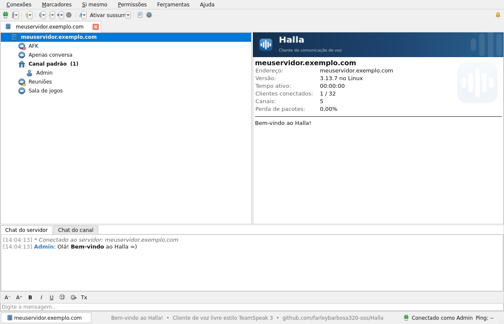
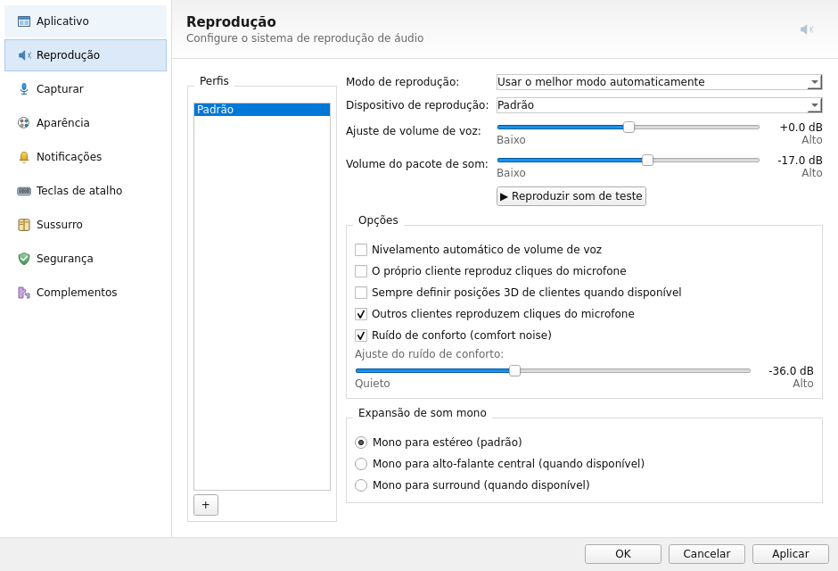
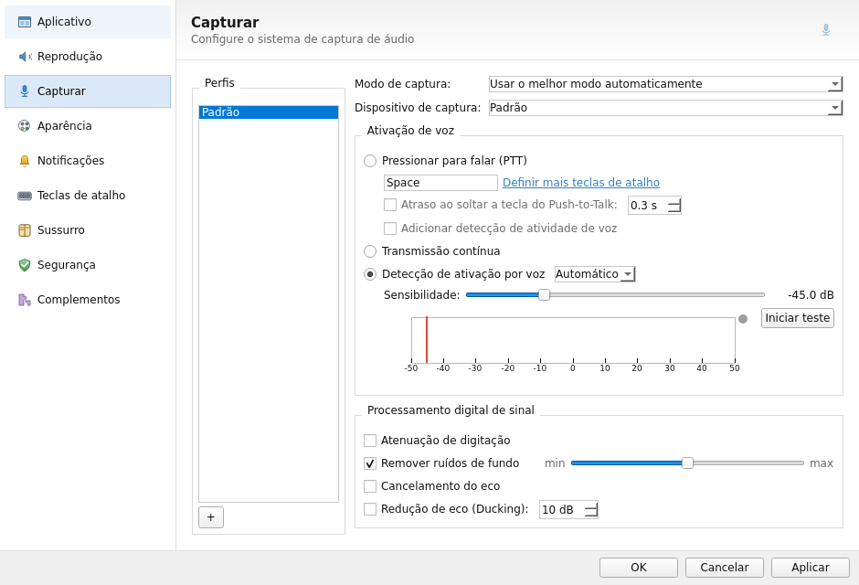

# Halla

Cliente de comunicação de voz para desktop, escrito em **C++ e Qt (Qt Widgets)**,
com a interface e o comportamento do **TeamSpeak 3 clássico (tema claro nativo)**:
barra de menus (Conexões, Marcadores, Si mesmo, Permissões, Ferramentas, Ajuda),
barra de ferramentas com setas suspensas, abas de servidor, corpo dividido meio a
meio (árvore de canais 50% | painel de informações 50% com marca d'água), console
de chat ocupando 100% da largura embaixo e barra de status em três zonas
(servidor | notícias | conexão com ping e perda de pacotes).

> **Observação sobre o protocolo:** o Halla é o **aplicativo cliente**. Ele
> conecta a servidores **[Halla Server](https://github.com/farleybarbosa320-oss/HallaServer)**
> (protocolo aberto e documentado — TCP/JSON para controle, UDP/Opus para
> voz). O protocolo do TeamSpeak 3 é proprietário e não faz parte deste
> projeto.



## Novidades da 3.13.0

- **Opções agora completas, no padrão controle-a-controle do TS3**, em
  cinco páginas retrabalhadas/novas:
  - **Reprodução** — perfis com botão "+", modo e dispositivo, ajuste de
    volume de voz e volume do pacote de som (sliders em dB, Baixo/Alto),
    "Reproduzir som de teste", nivelamento automático, cliques de
    microfone, posições 3D, ruído de conforto (Quieto/Alto) e expansão
    de som mono (estéreo/central/surround).
  - **Capturar** — perfis com "+", PTT com tecla configurável, **atraso
    ao soltar** (0–3 s, funciona de verdade na transmissão), PTT+detecção
    combinados, transmissão contínua, detecção de voz com sensibilidade
    em dB, **medidor visual de volume** (régua −50…+50 dB, limiar em
    vermelho, LED, botão "Iniciar teste") e o grupo de DSP: atenuação de
    digitação, remoção de ruído com intensidade, cancelamento de eco e
    **redução de eco (ducking)** que abaixa os demais enquanto você fala.
  - **Aparência** — estilo, tema, pacote de ícones, fonte, transparência
    da janela e o grupo **Árvore do canal** (expandir todos / até um
    nível / só o próprio canal — aplicado de verdade ao entrar —,
    clientes abaixo dos canais, bandeiras, Overwolf, emblemas, grupos
    nos menus, contadores, mini-ícones, mensagem de ausência, dicas),
    bandeja (minimizar/fechar) e GIF animado.
  - **Teclas de atalho** — perfis sincronizados (myHalla) + **perfis
    locais** com "+", tabela *Tecla de atalho × Ação* mostrando o PTT do
    perfil de captura (ex.: `MOUSE BUTTON 5 | Push-to-Talk`), botões
    Adicionar/Remover/Editar e seletor de perfil ativo; cada perfil
    guarda seus próprios atalhos, com migração automática dos antigos.
  - **Sussurro** *(nova página)* — quem pode sussurrar com você
    (contato / permitir / negar), aviso sonoro, histórico e atalho para
    a Lista de sussurros.
- **Volume mestre de voz e volume do pacote de som aplicados de verdade**
  (em dB, com efeito imediato); cabeçalhos das páginas com ícone em
  marca d'água, como no TS3.




## Novidades da 3.12.0

- **Janela de Opções redesenhada no padrão do TS3**: a faixa azul foi
  substituída por um cabeçalho com gradiente claro (título em negrito +
  subtítulo + ícone da seção à direita), menu lateral com ícones grandes
  e destaque suave com separador de 1px, grupos estilo *fieldset*
  clássico (linha fina cortada pelo título, interior transparente),
  páginas organizadas em duas colunas e OK/Cancelar/Aplicar alinhados à
  direita. A ativação de voz virou botões de opção, como no TS3.
- **Toolbar corrigida**: setas de menu suspenso ao lado (com área e
  divisor próprios, nunca sobrepostas), botões mais altos e espaçados,
  e o botão "Ativar sussurro" com ícone + texto + seta lado a lado.

## Novidades da 3.11.0

- **Interface redesenhada no estilo clássico do TeamSpeak 3**: tema claro
  nativo do Windows (fundo branco, cromo #F0F0F0, bordas retas de 1px),
  menus na ordem do TS3 (Conexões, Marcadores, Si mesmo, Permissões,
  Ferramentas, Ajuda), novo menu **Si mesmo** (ausente, silenciar
  microfone/alto-falantes, apelido, comandante, avatar), barra de
  ferramentas com botões de seta suspensa, divisão 50/50 entre árvore e
  informações (posição dos divisores é lembrada) e barra de status com a
  "aba" do servidor à esquerda, linha de notícias ao centro e estado da
  conexão com ping à direita.
- **Sussurro nas teclas de atalho**: nova ação **"Sussurrar (segurar para
  falar)"** — escolha o alvo (canal atual, canal atual + subcanais ou lista
  de usuários) e, enquanto segurar a tecla/botão, sua voz vai apenas para
  o alvo, como o *whisper* do TS3.
- **PTT com botões do mouse corrigido de vez**: a captura agora funciona em
  três camadas (eventos do widget, filtro do aplicativo e filtro NATIVO do
  Windows), então botões laterais e do meio são reconhecidos mesmo quando o
  software do mouse (Logitech/Razer etc.) envia "Voltar/Avançar". A detecção
  global também passou a ler o estado físico do botão a cada 50 ms, sem
  depender de mensagens de janela.
- **Teclas de atalho aceitam mouse**: qualquer atalho (não só o PTT) pode ser
  um botão do mouse.

## Novidades da 3.10.0

- **PTT com botões laterais do mouse!** A tecla de PTT agora pode ser uma
  tecla **ou** um botão do mouse (Mouse4/Mouse5/botão do meio) — selecione em
  Opções > Captura clicando com o botão sobre o campo. Funciona em segundo
  plano (Raw Input do Windows).
- **Hotkeys globais**: todas as ações configuradas em "Teclas de atalho"
  (mudo do microfone, alto-falantes, ausente, comandante, gravação,
  transmissão contínua) funcionam com o Halla **em segundo plano** no Windows.
- **Texto-para-voz (TTS)**: o Halla narra os eventos ("Fulano entrou no
  servidor", "Cutucada de Fulano"), como o pacote de voz do TS3. Ative em
  Opções > Notificações.
- **Descrição de canal com BBCode**: renderizada no painel de informações e
  no novo "Ver descrição do canal" (menu de contexto do canal).
- O **Halla Server 3.1.0** acompanha com o **ServerQuery** (administração
  remota em texto na porta 10011 — `login`, `serverinfo`, `clientlist`,
  `clientkick`, `banclient`, `gm`...).

## Novidades da 3.9.0 — paridade de recursos com o TeamSpeak 3

Em conjunto com o **Halla Server 3.0.0**:

- **Avatares**: defina, remova e veja avatares — enviados ao servidor e
  distribuídos aos outros clientes (menu Ferramentas > Avatar / "Ver avatar"
  no menu de contexto do usuário).
- **Pressionar-para-falar (PTT)** de verdade: escolha a tecla em Opções >
  Captura e segure-a para transmitir — funciona até com o Halla **em segundo
  plano** (hotkey global do Windows). Modos: PTT, detecção de voz e contínuo.
- **Notificações sonoras** estilo TS3: entrar/sair do servidor, cliente
  entrou/saiu, cutucada, mensagem privada, troca de canal, mudo — sons gerados
  localmente, configuráveis em Opções > Notificações.
- **Gravação de chamadas**: grava a conversa (sua voz + todos os outros) em
  WAV na pasta Documentos/Halla, com indicador de "gravando" — botão na barra
  de ferramentas ou Ferramentas > Iniciar gravação.
- **Sussurro**: direcione sua voz a uma lista de usuários específicos
  (Ferramentas > Listas de sussurro... / Ativar sussurro).
- **Mensagens offline**: deixe recados para usuários ausentes — eles recebem
  ao conectar (Ferramentas > Mensagens offline...).
- **Reclamações**: registre reclamações sobre usuários (menu de contexto) e
  administre-as em Permissões > Reclamações....
- **Lista de banidos**: veja e remova banimentos (Permissões > Lista de
  banidos...).
- **Grupos de servidores reais**: crie grupos, edite permissões por caixa de
  seleção e poder de fala, atribua a usuários — tudo com efeito imediato no
  servidor (Permissões > Grupos de servidores...).
- **Mostrar permissões do usuário**: visão real das suas permissões atuais.
- **Operadores de canal**: quem cria um canal vira operador dele (escudo
  verde) e pode editá-lo e expulsar usuários dele.
- **Transferência de arquivos**: compostilhe arquivos por canal
  (Ferramentas > Transferência de arquivos... — upload, download e exclusão
  no servidor).
- **Editar servidor virtual** renomeia de fato o servidor (nome + mensagem do
  dia) — com permissão de administrador.

## Recursos

- **Janela principal estilo TS3:** menus completos, barra de ferramentas com
  Conectar/Desconectar, Favoritos, Ausente, Mudo (microfone), Mudo
  (alto-falantes), Registro do cliente, Opções e Notificações.
- **Conexões múltiplas em abas** (estilo TS3 3.5+), com menu de contexto nas
  abas, fechar com o "x", desconectar tudo.
- **Árvore do servidor idêntica:** canais (padrão=ícone de casa, protegido por
  senha=cadeado, moderado, temporário em outra cor), contagem de clientes,
  usuários com anel verde ao falar e mini-ícones (mic mudo, fones mudos,
  ausente, gravando, comandante), *tooltips*, **arraste a si mesmo** entre
  canais e **duplo clique** para entrar no canal.
- **Menus de contexto completos** (servidor, canal e cliente): alternar para o
  canal, criar canal/sub-canal, editar, excluir, apelido, descrição, cutucar,
  volume, silenciar localmente, comandante do canal, expulsar, banir, mover.
- **Chat com BBCode** (`[b][i][u][color=][size=][url=]`), emojis, controle de
  tamanho do texto, abas de chat do servidor/canal e mensagens privadas.
- **Painel de informações** (banner + detalhes do servidor, canal ou cliente
  selecionado, com tempo ativo atualizando ao vivo).
- **Opções** com todas as páginas do TS3: Aplicativo, Design (tema **claro e
  escuro** funcionais), Notificações, Reprodução, Captura (PTT com tecla,
  nível de ativação de voz, redução de eco...), **Teclas de atalho** (atalhos
  funcionais dentro do app), Segurança e Complementos.
- **Favoritos** (gerenciador completo com auto-conectar), **conexões recentes**,
  **identidades** (ID único gerado por cliente, identidade padrão), **contatos**,
  **listas de sussurro**, **grupos de servidores** com grade de permissões do
  TS3 (modo avançado habilita a coluna "Conceder"), **chave de privilégio**,
  **client log** com filtro por nível e exportação.
- **Bandeja do sistema**, confirmação ao sair conectado, restauração de sessão,
  log em arquivo, configurações persistentes (`QSettings`).

## Compilação

### Instalador Windows (.exe) — já incluído

| Arquivo | Tamanho | Descrição |
|---|---|---|
| `Halla-Setup-3.6.2.exe` | ~15 MB | Instalador NSIS (licença, pasta, atalhos no Menu Iniciar/Área de trabalho, desinstalador em "Adicionar ou remover programas") |
| `Halla-3.6.2-win64-portable.zip` | ~20 MB | Versão portátil — descompacte e execute `Halla.exe` |

O instalador foi produzido por **compilação cruzada** (Linux → Windows) e
**validado executando o `Halla.exe` real** via Wine:

```bash
# 1) toolchain MinGW + NSIS + aqtinstall (baixa o Qt p/ Windows)
sudo apt install g++-mingw-w64-x86-64-posix nsis p7zip-full
pip3 install aqtinstall
python3 -m aqt install-qt windows desktop 6.8.2 win64_mingw -O ~/qt-win --archives qtbase

# 2) shim das ferramentas do Qt do host (moc/uic/rcc)
mkdir -p ~/qt-host-shim/lib && ln -sfn /usr/lib/x86_64-linux-gnu/cmake ~/qt-host-shim/lib/cmake

# 3) build cruzado
cmake -S . -B build-win -G Ninja \
  -DCMAKE_TOOLCHAIN_FILE=cmake/win64-mingw.cmake \
  -DCMAKE_PREFIX_PATH=~/qt-win/6.8.2/mingw_64 -DCMAKE_BUILD_TYPE=Release
cmake --build build-win        # gera build-win/Halla.exe

# 4) empacota DLLs do Qt + runtime MinGW em dist/Halla/, depois:
makensis packaging/halla-setup.nsi   # gera Halla-Setup-3.6.2.exe
```

### Linux (nativo)

```bash
sudo apt install cmake ninja-build qt6-base-dev
cmake -S . -B build -G Ninja -DCMAKE_BUILD_TYPE=Release
cmake --build build
./build/Halla
```

### Windows (MSVC + Qt 6)

```powershell
# Instale o Qt 6 (qt.io) com Qt Widgets e o Qt Creator/CMake
cmake -S . -B build -G "Visual Studio 17 2022" -DCMAKE_PREFIX_PATH="C:\Qt\6.8.0\msvc2022_64"
cmake --build build --config Release
build\Release\Halla.exe
```

### macOS

```bash
brew install qt@6 cmake ninja
cmake -S . -B build -G Ninja -DCMAKE_PREFIX_PATH=$(brew --prefix qt@6)
cmake --build build
open build/Halla.app
```

## Estrutura do código

```
src/
  main.cpp              # ponto de entrada (suporta --shot/--demo p/ capturas)
  version.h
  core/                 # modelo de dados (ServerData/Channel/User), log, QSettings
  gui/                  # ícones desenhados com QPainter, banner, árvore TS3,
                        # chat BBCode, painel de informações, tela inicial
  dialogs/              # Conectar, Criar/Editar canal, Identidades, Favoritos,
                        # Opções (8 páginas), Grupos/permissões, Log, Contatos,
                        # Sussurro, Transferências, Cutucar/Expulsar/Banir/Volume
  app/MainWindow.*      # janela principal: menus, toolbar, abas, status, bandeja
```
